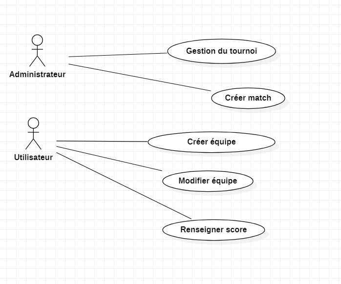
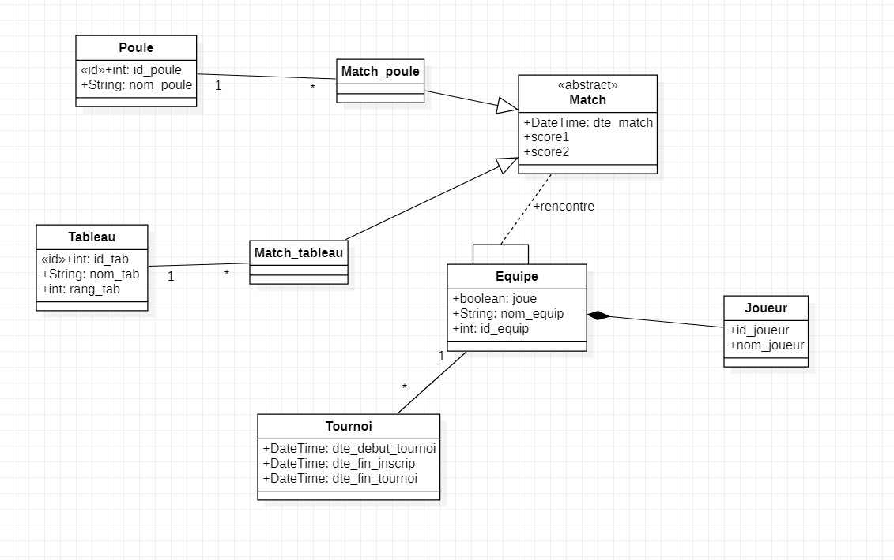
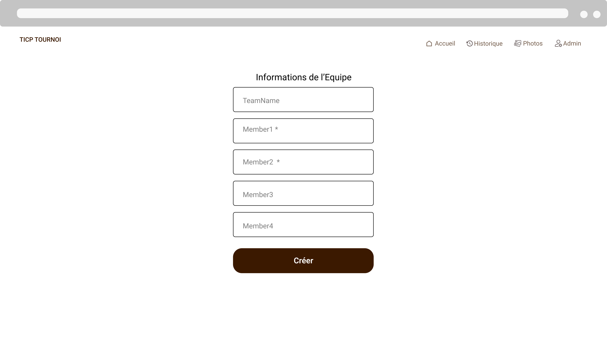
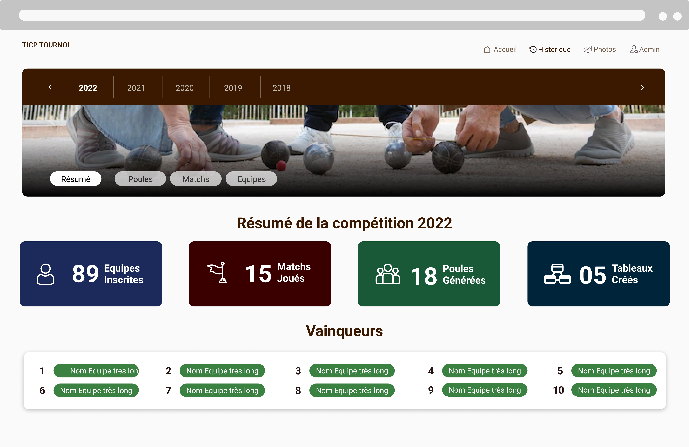
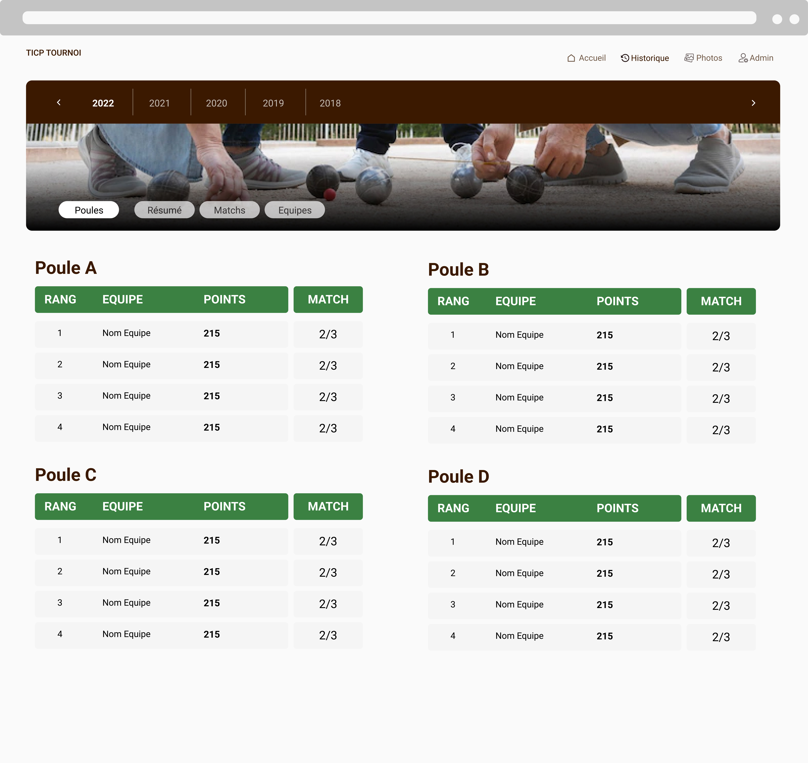

# DIAGRAMME

## DIAGRAMME DE CAS D'UTILISATION

Nous avons deux acteurs (les utilisateurs et l'administrateur) qui interagissent avec le système

### LES ACTIONS QU'UN ADMINISTRATEUR PEUT EFFECTUER :
- GÉRER UN TOURNOI:
    - LANCER TOURNOI: une fois qu'on arrive à la date fin d'inscription des équipes, l'administrateur lance un et un seul tournoi.
    - MODIFIER TOURNOI: cette fonctionnalité permet à l'administrateur de faire des modifications, si necessaire :
        - modifier la date début tournoi
        - changer la date fin tournoi
        - modifier la date début tournoi
        - changer la date fin tournoi
        - modifier la date de la phase de poule
        - changer la date de la phase finale
    
    - ANNULER TOURNOI: l'administrateur pourra annuler un tournoi dans certaines situations particulières(le covid par exemple).
-  GÉRER ÉQUIPE:
    -  MODIFIER ÉQUIPE: seul un administrateur peut disqualifier une équipe du tournoi, si celle-ci ne remplit pas certaines conditions  du tournoi.

- GÉRER MATCH
    - LANCER MATCH : l'administrateur lancera la création des matchs entre les équipes après la date fin d'inscription des équipes.

### LES ACTIONS QU'UN UTILISATEUR PEUT  EFFECTUER :

- GÉRER ÉQUIPE
    - MODIFIER ÉQUIPE : ce cas d'utilisation permet à l'utilisateur de mettre à jour son équipe : 
        - changerle nom de l'équipe 
        - changer le.s nom.s de membre de l'équipe
        - modifier le.s nom.s de membre de l'équipe

    - CREER ÉQUIPE : cette fonctionnalité permet à l'utilisateur de créer une équipe lors de  l'inscription en renseignant le nom de l'équipe et des joueurs qui la compose

- GÉRER MATCH
    - MODIFIER MATCH  : une fois que les équipes finissent leur match, cette action leur permettra de renseigner le  score final du match

### LES REGLES DE GESTION :

| Règle de Gestion                                                                                                            |
| ----------------------------------------------------------------------------------------------------------------------------|
| Les équipes sont formées de 2,3,4 personnes                                                                                 |
| Une poule est constituée de 3 ou 4 équipes                                                                                  |
| On peut créer au minimum trois tableaux  ou plusieurs dès lors qu'on a plusieurs équipes inscrites au tournoi               |
| Deux équipes d'une même poule ne doivent pas se rencontrer dès le 1er tour du tableau                                       |
| Le premier d'une poule doit rencontrer le deuxième d'une autre poule                                                        |
| Deux équipes d'une même poule doivent se rencontrer le plus tard possible                                                   |
| À la fin de la période d'inscription, les poules sont générées et on bloque la création des équipes                         |

## DIAGRAMME DE CLASSES

### DESCRIPTION DES  CLASSES

- TOURNOI: elle est caractérisée par un identifiant et six dates(date début d'inscription équipe, date fin d'inscription équipe, date début poule, date début tableau, date début tournoi, date fin tournoi).

- ÉQUIQUE: cette classe est caractérisée par un identifiant, un nom d'équipe, un état pour savoir si l'équipe est éliminée, disqualifiée...

- TABLEAU: elle possède un identifiant, un nom, et un rang pour faire la distinction entre les tableaux.

- MATCH: elle est caractérisée par un identifiant, une date qui ne sera renseignée par les équipes qu'après avoir  joué leurs matchs, et deux scores(renseignant le score des deux équipes s'affrontant).

- JOUEUR: cette classe possède un identifiant et un nom complet du  joueur.

- POULE: cette classe est caractérisée par un identifiant et un nom.

# MAQUETTE

## FONCTIONNALITES PRINCIPALES

### PAGE ACCUEIL ( État initial)
Il s'agit de la page principale. C'est la page qui se présente à l'utilisateur lorsque le tournoi est en phase "d'inscription"

### PAGE D'INSCRIPTION
Il s'agit de la page d'inscription des équipes. C'est la page qui se présente à l'utilisateur lorsqu'il souhaite inscrire son équipe au tournoi.

### PAGE D'ACCUEIL ( État Poule générée )
Il s'agit de la page principale. C'est la page qui se présente à l'utilisateur lorsque les inscriptions sont cloturées. Cette page présente les Poules constituées de Matchs.

### PAGE DES  TABLEAUX 
Il s'agit de la page qui présente les matchs de chaque tableau. Ces tableaux sont générés après la fin des Matchs de Poule.

## FONCTIONNALITES SECONDAIRES

### PAGE HISTORIQUES
Il s'agit de la page qui récapitule l'ensemble des tournois, matchs, équipes, poules, vainqueurs qui ont existé jusqu'à aujourd'hui.

### PAGE PHOTOS
Il s'agit de la page qui récapitule l'ensemble des tournois, matchs, équipes, poules, vainqueurs qui ont existé jusqu'à aujourd'hui.

### PAGE INFORMATIONS UTILES
Il s'agit de la page qui rappelle les règles du concours, les emplacements où se joue les matchs, les actualités et les échéances à respecter.

