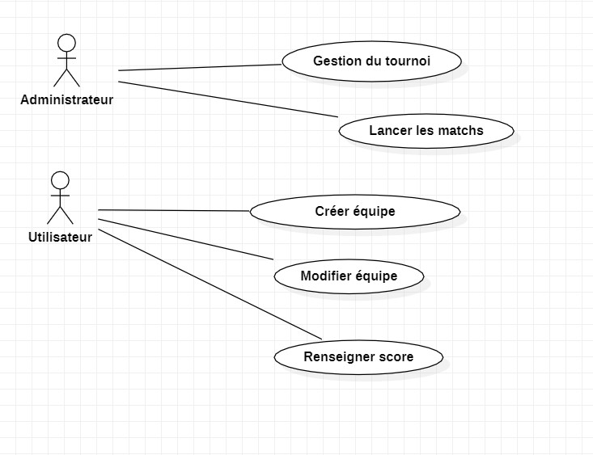
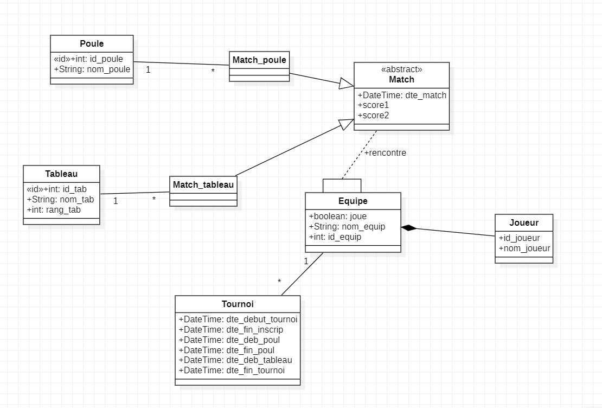
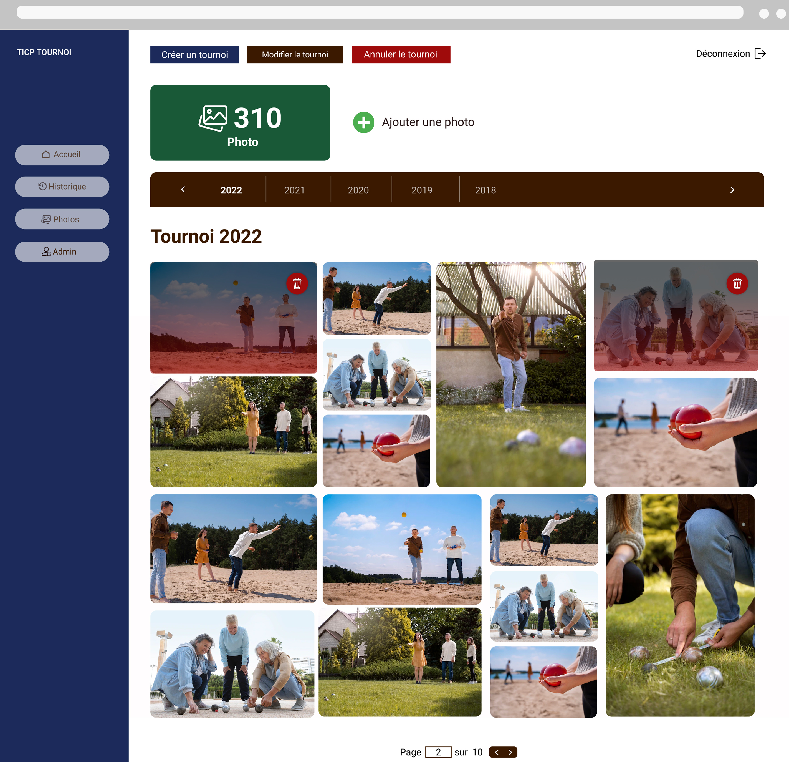
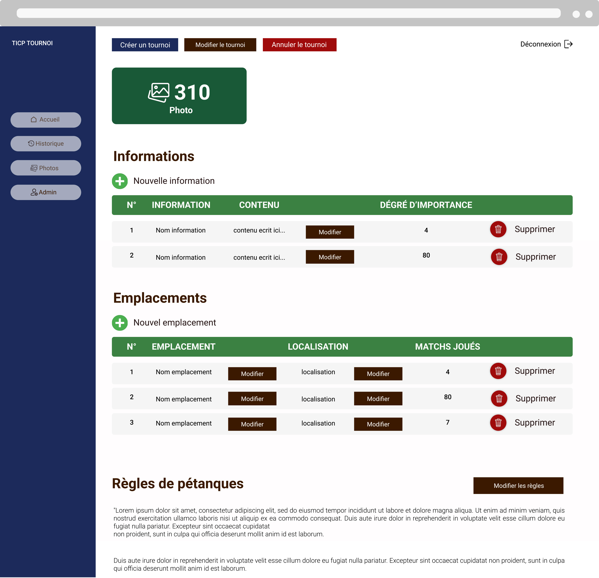
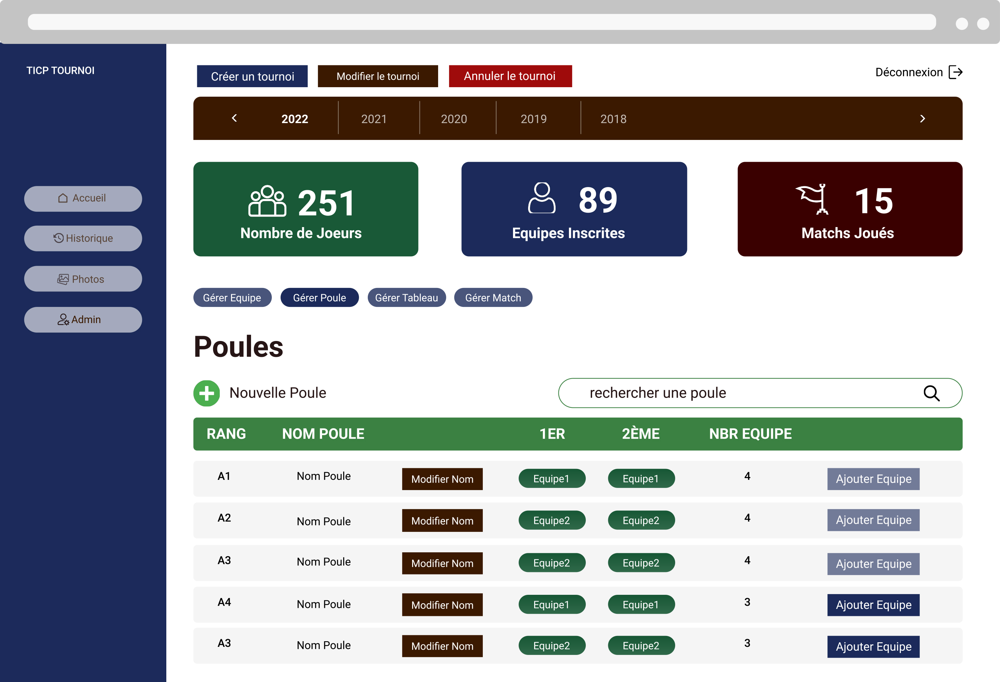
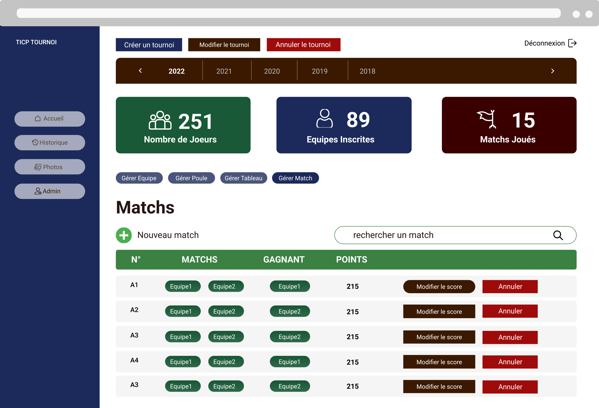
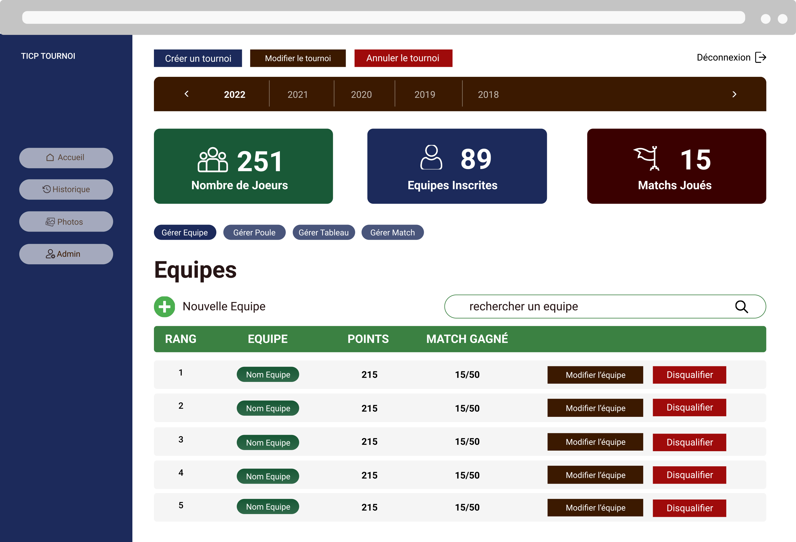
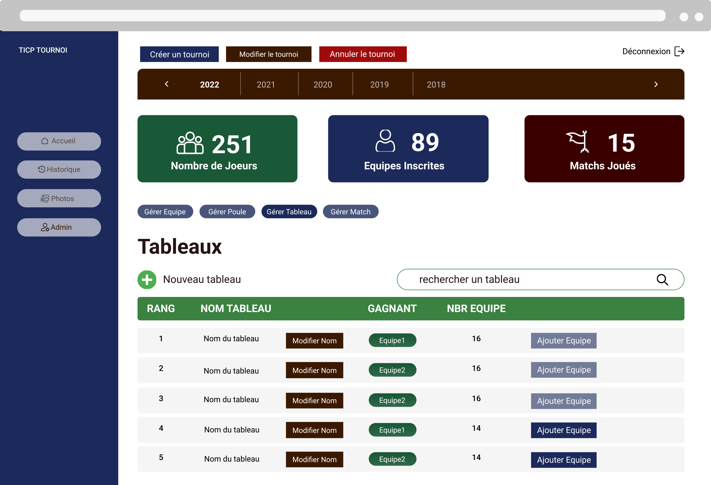

# DIAGRAMME

## DIAGRAMME DE CAS D'UTILISATION

Nous avons deux acteurs (les utilisateurs et l'administrateur) qui interagissent avec le système.

### LES ACTIONS QU'UN ADMINISTRATEUR PEUT EFFECTUER :
- GÉRER UN TOURNOI:
    - LANCER TOURNOI: une fois qu'on arrive à la date début d'inscription, l'administrateur lance un et un seul tournoi.
    - ANNULER TOURNOI: l'administrateur pourra annuler un tournoi dans certaines situations particulières (le covid par exemple).
    - MODIFIER TOURNOI: cette fonctionnalité permet à l'administrateur de faire des modifications, si necessaire, modifier la date de :
        - début d'inscription
        - fin d'inscription
        - début poule
        - fin poule
        - début de match tableau
        - la finale
    - UPLOADER LES PHOTOS : l'application dispose d'une page dédiée aux photos du tournoi. L'administrateur a donc la possibilité d'uploader ces dernières.
    - RENSEIGNER LES INFORMATIONS UTILES : l'administrateur peut renseigner les emplacements des terrains de Pétanque, les échéances à respecter et le rappel des règles du tournoi.

-  GÉRER ÉQUIPE:
    -  CRÉER ÉQUIPE: l'administrateur peut ajouter une nouvelle équipe après la fin des inscription.
    -  MODIFIER ÉQUIPE: durant le tournoi, l'administrateur peut avoir besoin de supprimer ou ajouter des membres à une équipe (par exemple si un nouveau joueur est disponible).
    - DISQUALIFIER ÉQUIPE: un administrateur peut disqualifier une équipe du tournoi, si celle-ci ne remplit pas certaines conditions  du tournoi.

- GÉRER MATCH
    - LANCER MATCH : l'administrateur lancera la création des matchs après la date fin des inscriptions. Suite à celà les poules sont générées automatiquement. Il en va de même pour les matchs de tableaux.
    - MODIFIER UN SCORE : l'administrateur peut modifier le score des matchs. Cette fonctionnalité est nécessaire lorsque les utilisateurs n'ont plus la possibilité de modifier le score (par exemple modifier les scores des matchs de poules alors qu'ils sont déjà cloturés).

### LES ACTIONS QU'UN UTILISATEUR PEUT  EFFECTUER :

- GÉRER ÉQUIPE
    - MODIFIER ÉQUIPE : ce cas d'utilisation permet à l'utilisateur de mettre à jour son équipe : 
        - Changer le nom de l'équipe 
        - Changer le nom d'un joueur de l'équipe

    - CREER ÉQUIPE : cette fonctionnalité permet à l'utilisateur de créer une équipe lors de la phase d'inscription en renseignant le nom de l'équipe et des joueurs qui la compose.

- RENSEIGNER UN SCORE : une fois que les équipes finissent leur match, cette action leur permettra de renseigner le score final du match.

### LES REGLES DE GESTION :

| Règle de Gestion                                                                                                            |
| ----------------------------------------------------------------------------------------------------------------------------|
| Les équipes sont formées de 2,3,4 personnes                                                                                 |
| Une poule est constituée de 3 ou 4 équipes                                                                                  |
| On peut avoir maximum 16 équipes par tableau              |
| Deux équipes d'une même poule ne doivent pas se rencontrer dès le 1er tour du tableau                                       |
| Le premier d'une poule doit rencontrer le deuxième d'une autre poule                                                        |
| Deux équipes d'une même poule doivent se rencontrer le plus tard possible                                                   |
| À la fin de la période d'inscription, les poules sont générées et on bloque la création des équipes                         |
| À la fin de la période de poule, on ne peut plus modifier les scores des matchs de poule                         |

## DIAGRAMME DE CLASSES

### DESCRIPTION DES  CLASSES

- TOURNOI: elle est caractérisée par un identifiant et six dates(date début d'inscription, date fin d'inscription, date début poule, date de fin de poule, date début tableau, date de la finale).

- ÉQUIQUE: cette classe est caractérisée par un identifiant, un nom d'équipe, un état pour savoir si l'équipe est éliminée, disqualifiée...

- TABLEAU: elle possède un identifiant, un nom, et un rang pour faire la distinction entre les tableaux.

- MATCH: elle est caractérisée par un identifiant, une date qui ne sera renseignée par les équipes qu'après avoir  joué leurs matchs, et deux scores(renseignant le score des deux équipes s'affrontant).

- JOUEUR: cette classe possède un identifiant et un nom complet du  joueur.

- POULE: cette classe est caractérisée par un identifiant et un nom.

# MAQUETTE

## FONCTIONNALITES PRINCIPALES

### PAGE ACCUEIL ( État initial )
Il s'agit de la page principale. C'est la page qui se présente à l'utilisateur lorsque le tournoi est en phase "d'inscription".

### PAGE D'INSCRIPTION
Il s'agit de la page d'inscription des équipes. C'est la page qui se présente à l'utilisateur lorsqu'il souhaite inscrire son équipe au tournoi.

### PAGE D'ACCUEIL ( État Poule générée )
Il s'agit de la page principale. C'est la page qui se présente à l'utilisateur lorsque les inscriptions sont cloturées. Cette page présente les Poules constituées de Matchs. Ces derniers sont générés automatiquement grâce à l'administrateur.

Il s'agit de la vision que l'on a lorsqu'on veut renseigner le score d'un match.

### PAGE DES  TABLEAUX 
Il s'agit de la page qui présente les matchs de chaque tableau. Ces tableaux sont générés après la fin des Matchs de Poule.

### PAGE ADMINISTRATEUR PHOTO 
Il s'agit de la page qui permet à l'administrateur d'ajouter ou supprimer les photos.

### PAGE ADMINISTRATEUR INFORMATIONS UTILES
Il s'agit de la page qui permet à l'administrateur de renseigner des informations utiles, emplacements et règles.

### PAGE ADMINISTRATEUR POULE 
Il s'agit de la page qui permet à l'administrateur de gérer les Poules.

### PAGE ADMINISTRATEUR MATCH 
Il s'agit de la page qui permet à l'administrateur de gérer les matchs.

### PAGE ADMINISTRATEUR EQUIPE 
Il s'agit de la page qui permet à l'administrateur de gérer les équipes, de les modifier ou de les disqualifier.

### PAGE ADMINISTRATEUR TABLEAU 
Il s'agit de la page qui permet à l'administrateur de gérer les tableaux.

## FONCTIONNALITES SECONDAIRES

### PAGE HISTORIQUES
Il s'agit de la page qui récapitule l'ensemble des tournois, matchs, équipes, poules, vainqueurs qui ont existé jusqu'à aujourd'hui.

### PAGE PHOTOS
Il s'agit de la page qui présente les photos de tous les tournois ainsi que les photos pour chaque tournoi individuellement.

### PAGE INFORMATIONS UTILES
Il s'agit de la page qui rappelle les règles du concours, les emplacements où se jouent les matchs, les actualités et les échéances à respecter.

